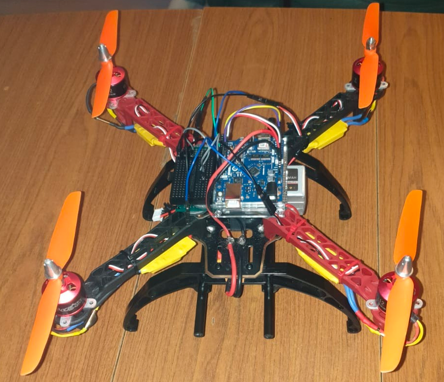

# Technical Documentation - Table of Contents

## 1. Abstract

<ol>

This project is designed to help anyone build a drone on their own. It includes all necessary equipment, schematics, code, and documentation.

</ol>

## 2. Drone Assembly Images

<ol>

1. Folder : Images show the bullet connectors being soldered onto the ESC and Motors
2. Folder : Images show the IMU being soldered with wire  jumpers
3. Folder : Images show the ESC being soldered to the frame        
4. Folder : Images shows the IMU being tested on the Arduino 
5. Folder : Images show the Motor and Esc being connected 
6. Folder : Images show the drone nearly assembled with the last few improvements being added in 
7. Folder : Images show the final assembled drone.
8. Folder : Poster of Drone

•    Step One: The first thing I did was run a dry fit because I needed to check that all the pieces could fit onto the frame and that that they were all compatible with each other, i.e., checking to see if the ESC and Motors wires are the right lengths to fit onto the quadrotor’s arms. 

•    Step Two: I soldered bullet connectors onto the ends of the ESC and Motor. 

•    Step Three: Soldering the ESCs to the frame

•    Step Four: I screwed the quadrotor arms into the frame. 

•    Step Five: Next I installed the ESC onto the quadrotor arm. ESC’s are fastened to the quadrotor arms with zip ties through the predrilled holes.

•    Step Six: Each motor is bolted to the quadrotor arm with four bolts and two pieces of motor mounts. At this point the ESC, quadrotor arm and motor should be attached to the drone.

•    Step Seven: The next step is to solder in the XT60 male plug connectors onto the frame. The plug is used to connect and disconnect the battery to the frame. This makes it possible to manually disable the power source in case of an emergency.

•    Step Eight: I insulated all the electrical connections with heat shrink tube to prevent short-circuits from occurring.

•    Step Nine: The battery was attached to the drone with several sticky pads and Velcro straps.

•    Step Ten: next I attached an Arduino onto the frame using sticky pads stuck onto a base that sits on top of the frame.

•    Step Eleven: I placed the IMU near the horizontal centre of the drone to maintain the centre of gravity 

•    Step Twevle: At this point I screwed in the propellers. 

•    Step Thirteen: The step is to connect the battery to the Frame. The ESC will make a beeping sound and the motors will spin for a few seconds. At this point the drone is fully assembled. 
</ol>

## 2. Schematic
<ol>
This folder has all the Schematics needed for the drone assembly

| Location      | Motor    | Direction              |
| ------------   | --------- |-------------           |
| Front Left  | Motor 1 | Clockwise            |
| Back Right  | Motor 2 |Counterclockwise |
| Back Left   | Motor 3  | Clockwise            |
| Back Right  | Motor 4 |Counterclockwise |

        1   2   */
         \ /    */
         / \    */
        3   4   */

</ol>

## 3. Code
<ol>

1. App Code
- Folder for Android App
- App Works with Android OS Lollipop

2. Flight Controller Code
- ESC_calibration Code: This code is used to test the motor to make sure that they're fully connected and able to spin. Can use this code to test which direction the motors are rotating. 

- Wifi_Test Code : This code is used to test out the wifi connection of the Arduino board

- Flight Controller Code : This is the flight controller for the drone that works with an IMU. It takes reading from IMU and uses PID control system to stabilise the drone during flight.

</ol>

## 4. Documents 
<ol>

1. Quadrotor_Drone_Components_List : Outlines the  components/tools and the price for them
2. Project Research Document : Background Research for the project
3. ESC manual : Explains how the ESC works 

</ol>

## 5. Video
<ol>

1. Components Tests Folder: Video in here show the test ran on the components
2. Flight Tests Folder : Videos show the flight testing of the drone 

</ol>

